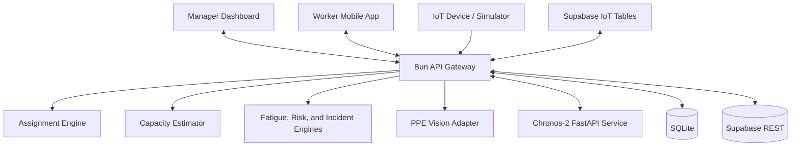

<p align="center">
  
</p>

<h1 align="center">Kawal</h1>

<p align="center">
  Caring for the People who Construct Our Future.
</p>

Kawal connects manager planning, worker field workflows, IoT safety telemetry, and operational intelligence in one system. Managers can schedule and assign work, monitor fatigue and environmental risk, respond to incidents, approve rest, and review completion evidence. Workers receive assignments, verify PPE, report hazards, request rest, submit work proof, and trigger SOS from a mobile-first interface.

## Core Capabilities

### Manager Operations

- Operational dashboard with crew state and project pace forecasting
- Multi-step task creation with priority, intensity, workload, and deadlines
- Single and bulk auto-assignment with ranked worker recommendations
- Assignment scoring based on skills, zone, workload, fatigue, and prior overtime
- Seven-day task calendar for assigned and unassigned work
- Worker detail pages with environment, fatigue, working hours, rest, and payroll context
- Completion proof approval and rejection
- Central notifications, rest requests, SOS signals, and incident actions

### Worker Workflow

- Mobile-first task workflow connected to manager actions
- PPE camera verification before work starts
- Task acceptance, start, pause, and completion states
- Direct camera capture or image upload for completion proof
- Worker notifications and manager updates
- Rest request and hazard reporting
- SOS action connected to the manager incident center

### Intelligence and Safety

- Capacity estimation for worker-hours, crew size, duration, and deadline feasibility
- Worker ranking using task intensity, workload, fatigue, and overtime recovery
- Chronos-2 productivity and delay forecasting through FastAPI
- Optional OpenAI vision verification for helmet and harness detection
- Deterministic SOS, rest, and device-command handling for auditable safety flows
- Supabase IoT ingestion for environment, work hours, inactivity, warnings, and rest breaks

## System Architecture



The React application always talks to the Bun API. The backend owns credentials, normalizes local or Supabase data, runs decision engines, and keeps manager and worker actions synchronized.

## Technology Stack

| Layer | Technology |
| --- | --- |
| Frontend | React 19, TypeScript, Vite 7 |
| Styling | Tailwind CSS |
| Backend | Bun, `Bun.serve` |
| Local storage | SQLite through `bun:sqlite` |
| Cloud data | Supabase REST |
| Forecasting | FastAPI, Amazon Chronos-2 |
| Computer vision | OpenAI vision or local demo provider |
| Icons | Lucide React |
| Testing | Vitest |

## Quick Start

### Requirements

- [Bun](https://bun.sh/) 1.3 or newer
- Python 3.10 or newer only when running Chronos-2

### Local Development

```bash
bun install
cp .env.example .env
bun run db:seed
bun run dev
```

The development command starts:

- React frontend: `http://localhost:5173`
- Bun API: `http://127.0.0.1:3001`

If either port is occupied, stop the existing process before starting Kawal.

### Development Accounts

| Role | Email | Password |
| --- | --- | --- |
| Manager | `manager@gmail.com` | `mm` |
| Worker | `worker@gmail.com` | `ww` |

These credentials are seeded for local development only.

## Seed Data

```bash
bun run db:seed
```

Seeding resets the local database and creates:

- 12 workers with varied roles, status, fatigue, workload, zone, and prior work hours
- 21 unassigned tasks distributed across a rolling seven-day schedule
- Manager and worker accounts
- Initial operational notifications and IoT device state

The local database is stored at `data/kawal.sqlite`.

## Runtime Modes

### Local Demo

```env
DATA_SOURCE=sqlite
PPE_CHECK_PROVIDER=demo
```

### Supabase Workforce

```env
DATA_SOURCE=supabase
SUPABASE_DATA_MODEL=workforce
SUPABASE_URL=https://your-project-ref.supabase.co
SUPABASE_SERVICE_ROLE_KEY=your-service-role-key
SUPABASE_SCHEMA=public
```

Run these SQL files in the Supabase SQL editor before starting the app:

1. `docs/supabase-schema.sql`
2. `docs/supabase-seed.sql`

This mode stores the application workforce model in Supabase while keeping the Bun API as the only frontend gateway.

### Supabase IoT

```env
DATA_SOURCE=supabase
SUPABASE_DATA_MODEL=iot
SUPABASE_URL=https://your-project-ref.supabase.co
SUPABASE_SERVICE_ROLE_KEY=your-service-role-key
```

The IoT adapter reads these existing Supabase tables:

- `environment_condition`
- `work_hours`
- `warning`
- `inactivity_log`
- `rest_break`


## Chronos-2 Forecasting

Create a Python environment and install the service dependencies:

```bash
python3 -m venv .venv
source .venv/bin/activate
python -m pip install -r services/chronos_api/requirements.txt
```

Start Chronos in a separate terminal:

```bash
bun run dev:chronos
```

Then start Kawal with `CHRONOS_API_URL=http://127.0.0.1:8001` in `.env`:

```bash
bun run dev
```

The first model-backed request may take longer because the Chronos model weights must be downloaded. When the service is unavailable, Kawal returns an explicit unavailable state instead of silently presenting a formula as an AI forecast.

## PPE Computer Vision

Worker PPE verification supports two providers.

### Demo Provider

```env
PPE_CHECK_PROVIDER=demo
```

Use this for offline demonstrations. It preserves the complete capture and scanning flow without requiring an external API.

### OpenAI Vision

```env
PPE_CHECK_PROVIDER=openai
OPENAI_API_KEY=your-openai-api-key
OPENAI_PPE_MODEL=gpt-5
```

The backend sends the captured frame for structured helmet and harness verification. A task can only start after the latest PPE check passes.

## IoT Simulator

Start the application first, then run one of the supported scenarios:

```bash
bun run simulate normal-shift
bun run simulate high-temperature
bun run simulate rest-button
bun run simulate sos-button
bun run simulate fall-candidate
bun run simulate offline-device
```

Device command results can also be simulated:

```bash
bun run simulate buzzer-success
bun run simulate buzzer-failure
```

The simulator posts versioned device envelopes to `POST /api/dev/iot/messages` and uses the device, worker, site, zone, and task identifiers configured in `.env`.

## Commands

| Command | Purpose |
| --- | --- |
| `bun run dev` | Start frontend and Bun API |
| `bun run dev:frontend` | Start Vite only |
| `bun run dev:api` | Start the Bun API in watch mode |
| `bun run dev:chronos` | Start the FastAPI Chronos service |
| `bun run db:seed` | Reset and seed local SQLite |
| `bun run simulate <scenario>` | Send an IoT simulation scenario |
| `bun run build` | Type-check and create a production build |
| `bun run test` | Run the Vitest suite |
| `bun run test:task-workflow` | Validate the connected manager-worker task flow |

## Project Structure

```text
src/
  assets/                  Brand and visual assets
  constants/               Navigation and seed workforce data
  hooks/                   Shared React data hooks
  pages/login/             Authentication screen
  pages/manager/           Manager dashboard and operational views
  pages/worker/            Worker mobile workflow
  server/                  Bun API, adapters, engines, and persistence
  types/                   Shared application contracts
services/chronos_api/      Python Chronos-2 service
docs/                       Architecture, Supabase, and IoT documentation
scripts/                    Development, simulation, and workflow scripts
data/                       Local SQLite runtime data
```

## API Overview

The main API groups are:

- `/api/auth/*` - login and role session setup
- `/api/workers/*` - worker app, PPE, task actions, rest, hazards, and SOS
- `/api/tasks/*` - task creation, assignment, and proof review
- `/api/assignment/*` - ranked assignment recommendations
- `/api/iot/*` - device state and commands
- `/api/incidents/*` - acknowledge, escalate, and resolve flows
- `/api/rest-requests/*` - manager approval and rejection
- `/api/chronos/*` - forecasting proxy
- `/api/notifications/*` - manager notification state

The complete repository-derived system map is available in [`docs/system-architecture.md`](./docs/system-architecture.md).

## Documentation

- [System architecture](./docs/system-architecture.md)
- [IoT architecture](./docs/iot-architecture.md)
- [Supabase IoT contract](./docs/supabase-iot-contract.md)
- [Supabase IoT mapping](./docs/supabase-iot-mapping.md)
- [Supabase rest break permissions](./docs/supabase-rest-break-permissions.sql)
- [Chronos service](./services/chronos_api/README.md)

## Validation

Before opening a pull request, run:

```bash
bun run build
bun run test
bun run test:task-workflow
```

Kawal keeps SOS and rest decisions deterministic, uses AI only where inference adds value, and exposes unavailable model states instead of hiding integration failures.

## AI Usage Disclosure

OpenAI Codex was used as an AI-assisted development tool during this project. It supported:

- Codebase exploration and implementation guidance
- UI refinement and component organization
- Debugging and merge-conflict resolution

The team remained responsible for product direction, architecture decisions, integration choices, validation, and the final submitted implementation.